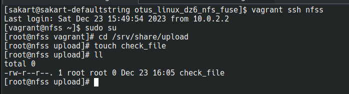
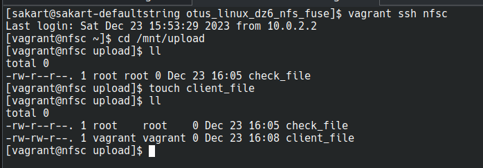
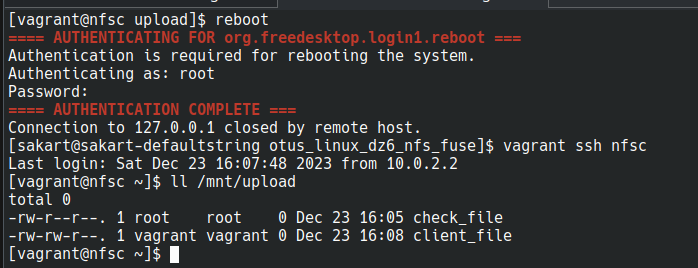
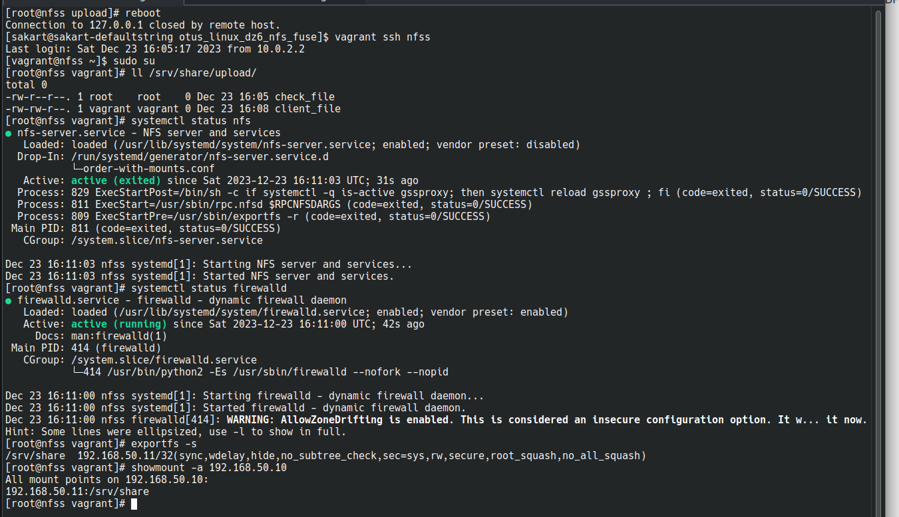
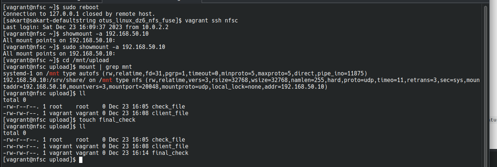

# otus_linux_dz6_nfs_fuse

# Стенд Vagrant с NFS

## Цель домашнего задания

- Научиться самостоятельно развернуть сервис NFS и подключить к нему клиента

## Описание домашнего задания

Основная часть:

- `vagrant up` должен поднимать 2 настроенных виртуальных машины (сервер NFS и клиента) без дополнительных ручных действий; - на сервере NFS должна быть подготовлена и экспортирована директория;
- в экспортированной директории должна быть поддиректория с именем __upload__ с правами на запись в неё;
- экспортированная директория должна автоматически монтироваться на клиенте при старте виртуальной машины (systemd, autofs или fstab -  любым способом);
- монтирование и работа NFS на клиенте должна быть организована с использованием NFSv3 по протоколу UDP;
- firewall должен быть включен и настроен как на клиенте, так и на сервере.

### Проверка работоспособности

- заходим на сервер
- заходим в каталог `/srv/share/upload`
- создаём тестовый файл `touch check_file`

- заходим на клиент
- заходим в каталог `/mnt/upload`
- проверяем наличие ранее созданного файла
- создаём тестовый файл `touch client_file`
- проверяем, что файл успешно создан

Предварительно проверяем клиент:

- перезагружаем клиент
- заходим на клиент
- заходим в каталог `/mnt/upload`
- проверяем наличие ранее созданных файлов

Проверяем сервер:

- заходим на сервер в отдельном окне терминала
- перезагружаем сервер
- заходим на сервер
- проверяем наличие файлов в каталоге `/srv/share/upload/` - проверяем статус сервера NFS `systemctl status nfs` - проверяем статус firewall `systemctl status firewalld` - проверяем экспорты `exportfs -s`
- проверяем работу RPC `showmount -a 192.168.50.10`

Проверяем клиент:

- возвращаемся на клиент
- перезагружаем клиент
- заходим на клиент
- проверяем работу RPC `showmount -a 192.168.50.10` - заходим в каталог `/mnt/upload`
- проверяем статус монтирования `mount | grep mnt`
- проверяем наличие ранее созданных файлов
- создаём тестовый файл `touch final_check`
- проверяем, что файл успешно создан

